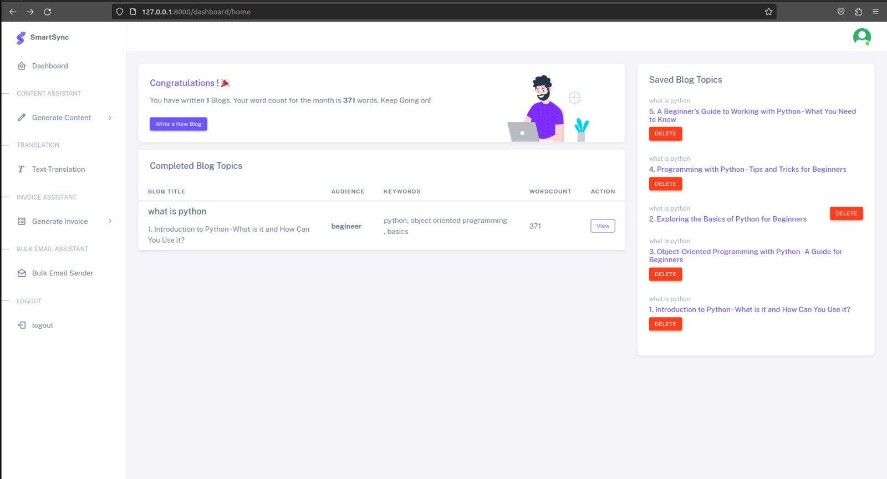
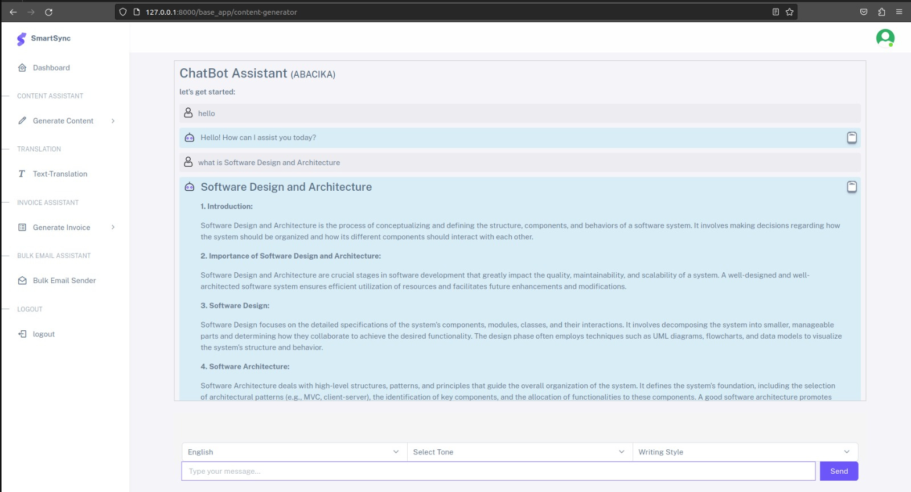
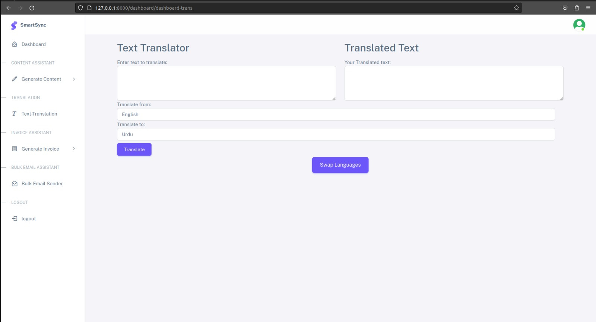
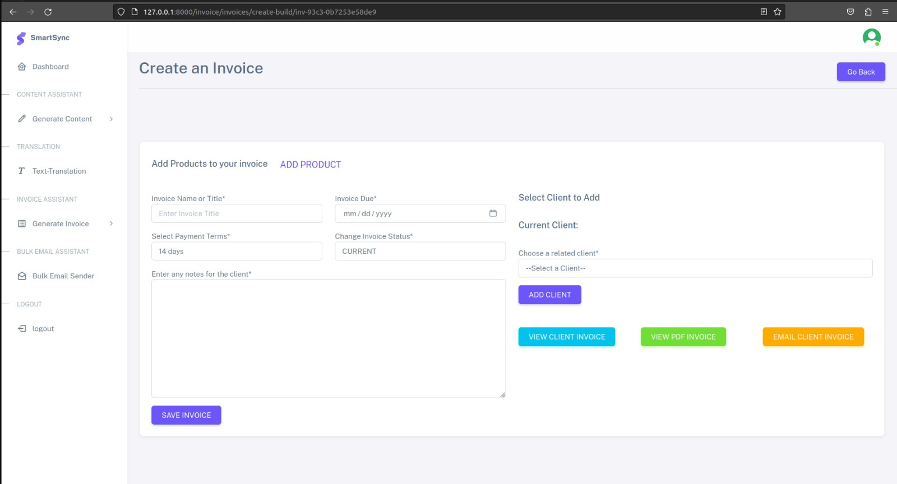
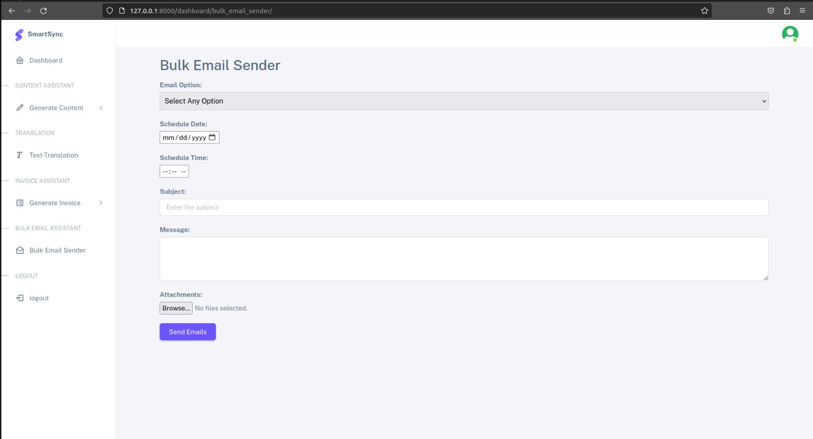

# 🤖 SmartSync — AI-Powered Business Automation Suite

> A full-stack SaaS platform for AI-driven blog generation, multilingual translation, invoicing, and **self-hosted bulk email automation with attachments**—powered by **GPT-3.5** and extendable to **custom LLMs via vLLM**.

[](https://python.org)
[](https://djangoproject.com)
[](https://openai.com)
[](https://vllm.ai)
[]()

---
## 🌟 Why SmartSync?

Unlike expensive, fragmented SaaS tools, SmartSync is:
- ✅ **All-in-one**: AI Content + Translation + Invoicing + **Email with Attachments**  
- ✅ **Self-hosted email** via **SMTP + Redis + Celery**—no third-party APIs  
- ✅ **Dual LLM backend**: **GPT-3.5** or your own **Llama 2 / Mistral** via **vLLM**  
- ✅ **Fully private**: Your data never leaves your infrastructure  

> 💡 **Reduce operational overhead by ~70%** while maintaining full control.

---
## ✨ Core Features

### 📝 AI Content Studio
- Generate **SEO-ready blogs** from keywords  
- Customize **tone**, **style**, and **language** (100+ options)  
- Interactive **chatbot** for Q&A-based ideation  

### 🌐 Smart Translator
- Real-time **text translation** across **100+ languages**  
- Context-aware output powered by **GPT-3.5** or **vLLM**  

### 💼 Invoicing Automation
- Create **branded, multi-currency invoices**  
- Manage **clients** and **product catalogs**  
- **PDF export** + direct email delivery  

### 📧 Self-Hosted Bulk Email
- Send scheduled emails to **CSV lists** or manual entries  
- **Attach files** (PDFs, images, documents)  
- **Time/date scheduling** via **Celery + Redis**  
- **No dependency on SendGrid, Gmail API, or AWS SES**  

---

## 🛠 Technology Stack

| **Category**            | **Technology / Tool**                          | **Purpose**                                                                 |
|-------------------------|-----------------------------------------------|------------------------------------------------------------------------------|
| **AI Models**           | GPT-3.5 (by OpenAI)                           | Core language model for text/blog generation and translation                 |
|                         | Llama 2 / Mistral                             | Open-weight models deployable via vLLM for private inference                |
| **AI APIs**             | OpenAI GPT-3.5 API                            | REST API for AI-powered content generation                                   |
|                         | OpenAI Text Translation API                   | API for multilingual text translation using GPT-3.5                          |
|                         | vLLM API                                      | High-throughput serving API for custom LLMs (e.g., Llama 2)                  |
| **Backend**             | Python 3.8+                                   | Primary programming language                                                 |
|                         | Django 4.0+                                   | Web framework (MVC architecture)                                             |
| **Task & Message Queue**| Celery                                        | Asynchronous task processing (e.g., scheduled emails)                        |
|                         | Redis                                         | Message broker for Celery                                                    |
| **Database**            | SQLite                                        | Default embedded database (file-based)                                       |
|                         | PostgreSQL (ready)                            | Production-ready relational database support                                 |
| **Email System**        | Self-hosted SMTP                              | Private email delivery (no third-party services)                             |
|                         | MIME                                          | Standard for email attachments (PDFs, images, documents)                     |
| **Frontend**            | HTML5, CSS3                                   | Semantic markup and styling                                                  |
|                         | JavaScript (ES6+)                             | Client-side interactivity                                                    |
|                         | AJAX                                          | Dynamic content loading without page refresh                                 |
|                         | Bootstrap 5                                   | Responsive UI components                                                     |
|                         | jQuery                                        | DOM manipulation and event handling                                          |
| **Scheduling**          | Celery + Redis                                | Time/date-based email automation                                             |
| **Dev Tools**           | VS Code, PyCharm Professional                 | Primary IDEs                                                                 |
|                         | Jupyter Notebook                              | Prototyping and experimentation                                              |
|                         | Postman                                       | API testing and debugging                                                    |
|                         | Anaconda                                      | Environment and dependency management                                        |
| **Deployment**          | Ubuntu                                        | Recommended OS (required for Redis stability)                                |
|                         | DigitalOcean / GCP / Azure                    | Cloud platforms for scalable hosting                                         |

---

## 📸 UI Showcase







---

## 🚀 Quick Start

```bash
   git clone https://github.com/Mr-Anwaar/SmartSync.git
   cd SmartSync
   python -m venv venv && source venv/bin/activate
   pip install -r requirements.txt
   python manage.py migrate
   python manage.py runserver
````

## 📜 License & Collaboration:

This project is unlicensed and all rights reserved.
For collaboration or usage inquiries.

please contact:
💼 LinkedIn: https://www.linkedin.com/in/muhammad-anwaar-7a1221214
